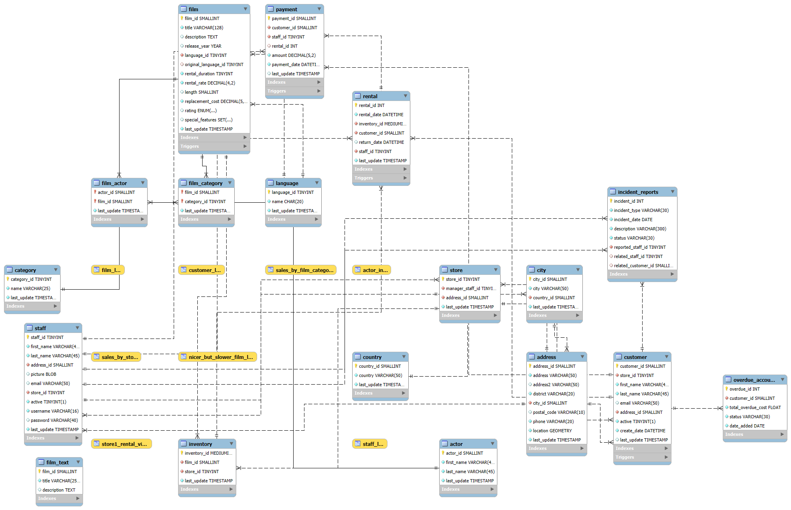

# Sakila DB-Based Anomaly Detection & Fraud Management System

> A database design and SQL-based analytics project built on the Sakila sample database to detect, log, and manage internal fraud, long-term overdues, and suspicious transactions in a movie rental shop environment.

---

## 1. Project Overview
- Objective: Extend and restructure the standard Sakila sample database, which primarily consists of normal transactions to implement a risk management and fraud detection system.
- Key Use Cases (User Stories):
  - Store Owner: Monitor staff processing unauthorized non payment rentals and track total financial losses from 90+ day unreturned items.
  - Risk Manager: Identify malicious customers who repeatedly rent high-value films without returning them, and manage unlisted long-term overdue accounts.

---

## 2. Database Modeling (ERD & Schema)
Designed and added two new tables satisfying Third Normal Form (3NF) to support risk tracking:
- 'overdue_accounts': Manages customers with 90+ day overdues and total accumulated financial damages.
- 'incident_reports': Logs anomalous activities, incident types, descriptions, and investigation statuses.

---

## 3. Scenario & Data Simulation
Simulated realistic anomalies and edge cases using custom 'UPDATE' and 'INSERT' scripts:
1. Internal Fraud: Modified data to reflect a staff member processing multiple free rentals.
2. Long-Term Overdues: Simulated a scenario where a customer keeps rented films indefinitely without returning them.
3. Conflict of Interest: Discovered and flagged transactions where staff and customers share the exact same last name.
4. Malicious High-Value Theft: Engineered a scenario where a high-risk customer selectively rents high-replacement-cost films and goes dark.

---

## 4. Key SQL Implementation & Insights

### 1. Detecting Internal Staff Fraud (Zero Payments)
Queries staff members in Store 1 who processed one or more zero-amount payment transactions.
'''sql
SELECT s.staff_id, s.first_name, s.last_name, COUNT(p.payment_id) AS zero_payment_count
FROM staff s
JOIN payment p ON s.staff_id = p.staff_id
WHERE s.store_id = 1 AND p.amount = 0.0
GROUP BY s.staff_id
HAVING zero_payment_count > 0;'''

### 2. Identifying High-Value Unreturned Item Risk
Filters high-risk customers who have failed to return 3 or more films whose replacement cost exceeds the overall average.
'''sql
SELECT c.customer_id, c.first_name, c.last_name, COUNT(r.rental_id) AS unreturned_count, SUM(f.replacement_cost) AS total_debt        
FROM customer c
JOIN rental r ON c.customer_id = r.customer_id
JOIN inventory i ON r.inventory_id = i.inventory_id
JOIN film f ON i.film_id = f.film_id
WHERE r.return_date IS NULL                         
  AND f.replacement_cost > (SELECT AVG(replacement_cost) FROM film)
GROUP BY c.customer_id, c.first_name, c.last_name   
HAVING unreturned_count >= 3                        
ORDER BY total_debt DESC; '''

## 5. What I Learned
Transformed a standard data repository into an active risk-management tool by embedding business security logic directly into relational database design.

